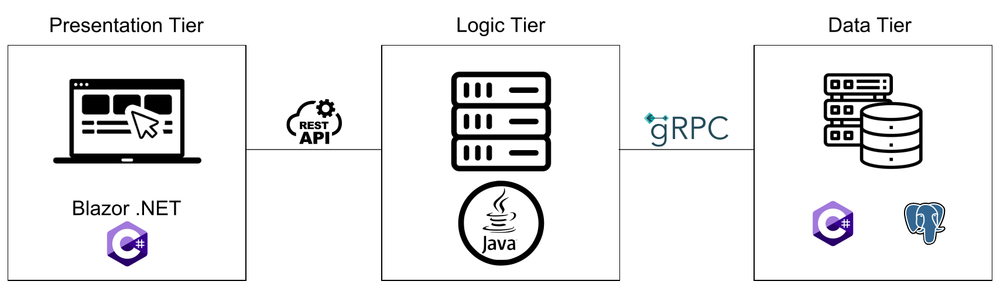
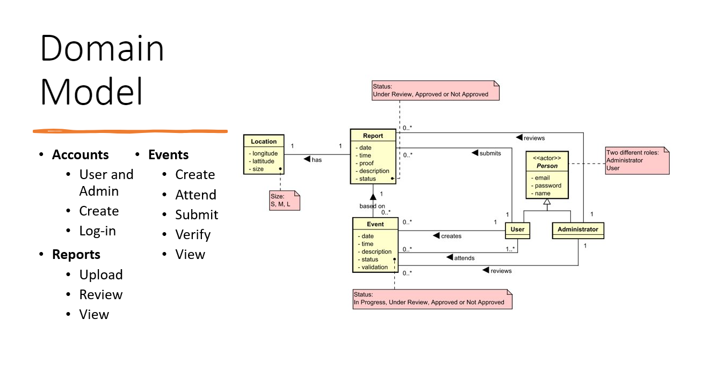

## **Semester Project: Heterogeneous Systems**

We set out to create a web application for an NGO specialising in climate action. Their purpose is to bring awareness to pollution in local areas and sustainable ways of living. They do this by collecting reports of locations in need of cleaning and later organising events to restore them. [A short video](https://www.youtube.com/watch?v=hJ48cY8RlUY) showcasing the system and its features.

The system was developed using the approach of 3-tier architecture, the presentation and data tiers programmed in C# and the logic layer in Java. The communication between these layers is handled by using REST API between the presentation and business logic and by gRPC between logic and data tier. The front-end was implemented using MudBlazor. The back-end uses a PostgreSQL database, EFC, and ASP.NET Identity.  

  

We wanted to create a system that allows the NGO to keep track of upcoming events and volunteers to report locations in need of cleaning. Furthermore, the employees would retain control by reviewing which reports were relevant and whether the cleaning process was sufficient. From the analysis, we determined the following use cases and drew the domain model.

  

*ECTS: 10*

### What I've done
  - Handling credentials using JWT in the front-end, and ASP .NET Identity on the back-end
  - Build the Events subpages using MudBlazor, Components and asynchronous programming
  - Build logic-tier with Maven and Spring-boot in Java running a RESTful API
  - Managing an online PostgreSQL database using Entity Framework Core
  - Complex queries through multiple tables using LINQ

I worked together with:
  - https://github.com/apeTrackunit
  - https://github.com/kegliitis
  - https://github.com/JcullenNZ
  - https://github.com/sofiaa21  

  
Course description

  ### Main purpose
  The purpose is to  
  - develop and document a distributed, heterogeneous system
  - account for the security aspects of the system  
  - promote the students' independent literature search and reference management  
  - promote critical thinking as well as holistic view with a focus on the UN's Sustainable Development Goals.  

  ### Knowledge
  ​Can refer to involved theories in order to increase efficiency for the group as a whole but also for the individual student.  

  ### Skills
  In addition to the skills acquired in IT-SEP2, the student will be able to:  
  - Implement heterogeneous systems using multiple network protocols  
  - Analyse the security risks of a distributed system  
  - Use a version control system to manage versions  
  - Search, find and include relevant knowledge  
  - Argue for the choice of sources and references in connection with the project work.  
  - Work with a holistic view of the project, the subjects and the outside world.  

  ### Competences
  In addition to the competences acquired in IT-SEP2, the student will be able to:  
  - Analyse, design, implement and test a distributed system using UML, Java and C#  
  - Construct a distributed system with the proper selection of architectural patterns  
  - Argue for the choice of various technical solutions for implementing distributed systems  
  - Use a defined methodology to structure the development process  
  - Take responsibility for structuring and adapting the form of collaboration to the members' personal and interpersonal competencies  
  - Take responsibility, in collaboration with the group, for the work process in connection with report writing and presentation.  
  - Work analytically, methodically and structured with the semester project in the project group.  
  - Can plan, adapt and optimize a project process with reasoned selection of the specific project management tools.  

